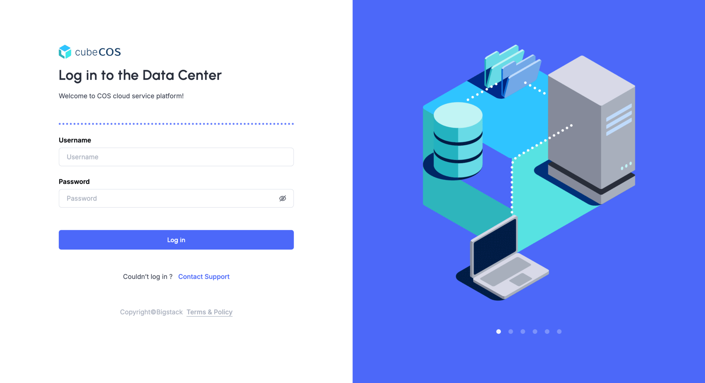

# CubeCOS (Cube Cloud Operating System)

 
 

  

[![License][License-Image]][License-Url] [![Slack][Slack-Image]][Slack-Url] [![Discord][Discord-Image]][Discord-Url] [![Docs][Docs-Image]][Docs-Url] [![Website][Website-Image]][Website-Url] [![Youtube][Youtube-Image]][Youtube-Url]

  

CubeCOS is built for you: an open-source, out-of-the-box virtualization platform with simple management and the flexibility to integrate with anything.

Join us in building the future of software-defined infrastructure!

## ⚡️ Installation

Download CubeCOS from the [Release Page](https://github.com/bigstack-oss/cubecos/releases/latest), and check out our [quick start installation](https://docs.bigstack.co/docs/cubecos/quick-start/overview) guide.

## 📚 Documentation

Get started by exploring our documentation at [CubeCOS documentation](https://docs.bigstack.co/docs/cubecos/getting-started/overview).

## 🚀 Features

- **Performant Virtualization**: A flexible hypervisor for virtual machines and containers based on QEMU/ KVM
- **Multi-Tenant Architectur**: Create secure environments for every team, use case or experiments through network and workload isolation
- **Intuitive Self-Service Portal**: Launch and manage VMs, containers, and networks instantly from a streamlined dashboard
- **Out of the Box Cluster**: A fully functional virtualization and cloud platform with pre-integrated services ready to host your services
- **Open Standards & RESTful APIs**: Standardized APIs that make it easy to connect, script, and scale infrastructure operations

## 💭 Getting Help/ Community

For any issues or questions during installation, connect with us via these community support channels::

1. Slack (EN) [Community][Slack-Url]
2. Discord (EN/ZH-Han) [Community][Discord-Url]
3. GitHub [Discussion](https://github.com/bigstack-oss/cubecos/discussions)
  
Please **do not** open issues which are unrelated to bugs on the [Issues](https://github.com/bigstack-oss/cubecos/issues) page.

For enterprise support, reach out to us through our [Contact Us](https://www.bigstack.co/contact-us).

For business partnerships or opportunities, connect with us via [Partners](https://www.bigstack.co/contact-form/partner).

## Contributing and development

Contributions are welcome. See [CONTRIBUTING.md](CONTRIBUTING.md) for development guidelines and architecture documentation.

## Community

Have questions or want to discuss CubeCOS development? Connect with us, check out our [Community Channels](https://www.bigstack.co/community) or start a conversation in our [Discussion](https://github.com/bigstack-oss/cubecos/discussions).

- [License](./LICENSE)
- [Contributing](./CONTRIBUTING.md)
- [Code of Conduct](./CODE_OF_CONDUCT.md)
  - [Bash Convention](./doc/code_of_conduct_bash.md)
- [Security](./SECURITY.md)

To report bugs, please create an issue in our [GitHub Issues](https://github.com/bigstack-oss/cubecos/issues). Do not report security vulnerabilities via GitHub Issues.

To report security vulnerabilities, follow the steps outlined in our [Security](./SECURITY.md) policy or through [GitHub Security Reporting](https://github.com/bigstack-oss/cubecos/security/advisories/new).

## License

Copyright (c) 2025 [Bigstack co., ltd](https://bigstack.co/)

Licensed under the Apache License, Version 2.0 (the "License");
you may not use this file except in compliance with the License.
You may obtain a copy of the License at

[http://www.apache.org/licenses/LICENSE-2.0](http://www.apache.org/licenses/LICENSE-2.0)

Unless required by applicable law or agreed to in writing, software
distributed under the License is distributed on an "AS IS" BASIS,
WITHOUT WARRANTIES OR CONDITIONS OF ANY KIND, either express or implied.
See the License for the specific language governing permissions and
limitations under the License.

[License-Url]: https://www.apache.org/licenses/LICENSE-2.0
[License-Image]: https://img.shields.io/badge/License-Apache2-blue.svg?style=flat-square
[Slack-Image]: https://img.shields.io/discord/1372094838089977887?style=flat-square&logo=Slack
[Slack-Url]: https://join.slack.com/t/cubecos/shared_invite/zt-2yalb3gmr-rETnY7SBxlgmBw7Gxac9tA
[Discord-Image]: https://img.shields.io/discord/1372094838089977887?style=flat-square&logo=discord
[Discord-Url]: https://discord.gg/VuMX4UhEFG
[Docs-Image]: https://img.shields.io/badge/docs-view-green.svg?style=flat-square&logo=docusaurus
[Docs-Url]: https://docs.bigstack.co
[Website-Image]: https://img.shields.io/badge/web-view-blue.svg?style=flat-square
[Website-Url]: https://www.bigstack.co/
[Youtube-Image]: https://img.shields.io/youtube/views/peTSzcAueEc?style=flat-square&logo=youtube
[Youtube-Url]: https://www.youtube.com/@bigstacktech
